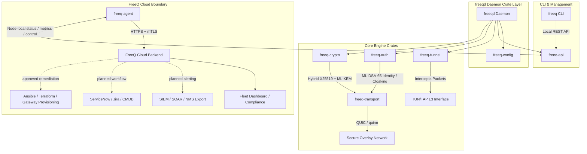

# FreeQ

**Post-quantum encrypted overlay network. Open source. Free forever.**

[](https://github.com/freeq-io/freeq-core/actions/workflows/ci.yml)
[](LICENSE)
[](https://www.rust-lang.org)
[](https://discord.gg/freeq)

> ⚠️ **Alpha — not yet audited.** FreeQ has not received an independent cryptographic audit. Do not use to protect classified or life-safety data. See [SECURITY.md](SECURITY.md).

---

## The problem

Nation-state adversaries are recording your encrypted network traffic **right now** with the intent to decrypt it once quantum computers arrive — the **harvest now, decrypt later** attack. The timeline for cryptographically-relevant quantum computers is estimated at 10–15 years. Data with a long shelf life — health records, financial transactions, intellectual property, communications — is at immediate risk.

The most widely deployed network encryption tools were built on classical cryptography:

- **WireGuard** uses Curve25519 and ChaCha20 — both broken by Shor's algorithm
- **TLS 1.3** defaults to ECDHE with X25519 or P-256 — same story
- **OpenVPN / IPsec** — legacy protocols with no post-quantum roadmap

Every encrypted packet sent today over these protocols is a future liability.

## The solution

FreeQ wraps all traffic between trusted endpoints in **hybrid post-quantum tunnels** using NIST-finalized standards. Every connection is:

- **Double-encrypted** — X25519 (classical) + ML-KEM-768 (FIPS 203, post-quantum). Security holds if *either* algorithm remains unbroken.
- **Mutually authenticated** — ML-DSA-65 (FIPS 204) identity keys. Endpoints silently drop all packets from unauthenticated peers — no SYN-ACK, no banner, no ICMP response.
- **Forward-secret** — ephemeral KEM keypair per session. Long-term key compromise does not expose past traffic.
- **Crypto-agile** — switch ML-KEM parameter sets (512/768/1024) at runtime without restarting nodes.

## Quick comparison

|                        | FreeQ              | LegacyVPN     | Mesh Overlay   |
|------------------------|--------------------|---------------|----------------|
| Post-quantum crypto    | ✅ FIPS 203/204/205 | ❌             | ❌              |
| Open source            | ✅ AGPL v3          | ✅ GPLv2       | Partial        |
| Self-hostable          | ✅ Full             | ✅ Full        | Via Headscale  |
| Memory safe            | ✅ Rust             | C (kernel)    | Go             |
| Endpoint cloaking      | ✅                  | ❌             | ❌              |
| Fleet management       | ✅ Paid (Cloud)     | DIY           | ✅ Paid         |

## How it works

Every FreeQ connection uses an 8-step mutual authentication and hybrid key exchange:

```
Node A → Node B   ML-DSA-65 signature over (nonce ‖ A_kem_pubkey)
Node B            Verify A's identity
Node B → Node A   ML-DSA-65 signature over (nonce ‖ A_nonce ‖ B_kem_pubkey)
Node A            Verify B's identity — mutual auth complete
Node A → Node B   ML-KEM-768 encapsulation
Both nodes        X25519 ECDH in parallel
Both nodes        session_key = HKDF-SHA256(kem_secret ‖ ecdh_secret, nonce)
Both nodes        AES-256-GCM bulk encryption begins. Ephemeral keys zeroized.
```

## Project structure

```
freeq-core/
├── crates/
│   ├── freeq-crypto/      # PQC primitives, hybrid KEM, crypto-agility traits
│   ├── freeq-transport/   # QUIC session management (quinn)
│   ├── freeq-tunnel/      # TUN/TAP interface, packet routing
│   ├── freeq-auth/        # ML-DSA-65 identity, peer registry, endpoint cloaking
│   ├── freeq-config/      # TOML configuration and peer policies
│   └── freeq-api/         # Local REST API — Apache 2.0 (FreeQ Cloud agent bridge)
├── daemon/                # freeqd — the overlay network daemon
├── cli/                   # freeq — management CLI
├── deploy/ansible/        # Host provisioning and systemd rollout
└── docs/                  # Architecture, crypto design, threat model
```



## Cryptographic dependencies

| Crate             | Version       | Purpose                  | Standard  |
|-------------------|---------------|--------------------------|-----------|
| ml-kem            | 0.3.0-rc.2    | Key encapsulation        | FIPS 203  |
| ml-dsa            | 0.1.0-rc.8    | Digital signatures       | FIPS 204  |
| slh-dsa           | 0.2.0-rc.4    | Hash-based DSA (backup)  | FIPS 205  |
| x25519-dalek      | 2.0           | Classical ECDH           | RFC 7748  |
| hkdf              | 0.12          | Key derivation           | RFC 5869  |
| aes-gcm           | 0.10          | Bulk encryption          | FIPS 197  |
| chacha20poly1305  | 0.10          | Bulk encryption (ARM)    | RFC 8439  |
| quinn             | 0.11          | QUIC transport           | RFC 9000  |

## Roadmap

Status key: `[x]` implemented in the current repo, `[~]` partially implemented or scaffolded, `[ ]` not implemented yet.

**v0.1 — Alpha (current, mostly implemented)**
- [x] Workspace scaffold and crate architecture
- [x] ML-KEM-768 + X25519 hybrid KEM implementation, including round-trip tests and hardened fallback handling
- [x] ML-DSA-65 identity keys, peer registry, mutual-auth handshake state machine, and responder/initiator tests
- [x] QUIC transport via `quinn`, including datagram send/receive, framing/reassembly, and loopback coverage
- [x] TUN/TAP L3 overlay pipeline, including macOS `utun`, Linux `/dev/net/tun`, IPv4 routing, AEAD packet wrapping, and daemon packet I/O bridges
- [x] Endpoint cloaking for signed packets from registered peers
- [x] TOML configuration loading and validation
- [x] Local REST API server with live `/v1/status`, `/v1/metrics`, and aggregate `/v1/tunnels` state
- [x] `freeqd` startup path with identity generation/loading, tunnel service initialization, API state refresh, QUIC session negotiation, and tested in-memory dataplane forwarding over real loopback QUIC
- [x] Ansible host provisioning layer for binary rollout, config templating, systemd, service user setup, and local health checks
- [~] Basic CLI command surface exists, but command handlers still need to call the local API; `up`/`down` are not present yet
- [~] Peer and algorithm API routes are declared, but peer add/remove/rotate and algorithm switching still return `501 Not Implemented`
- [~] Host deployment is ready for validation, but real two-host Linux/macOS bring-up, interface address configuration, and production routing setup still need to be exercised
- [~] Active transport/auth path lives in `freeq-auth` plus daemon integration; an older unexported `freeq-transport/src/handshake.rs` file still contains stale `todo!()` code and should be removed or reconciled

**v0.2 — Q3 2026 (next hardening and management slice)**
- [ ] io_uring data plane (Linux 5.19+); currently only noted as future dependency work
- [ ] Session resumption; an inactive scaffold exists, while the current QUIC config intentionally disables 0-RTT
- [~] ML-KEM-1024 parameter set selection is present in config/agility types and Cargo features, but the active KEM implementation is still ML-KEM-768-only
- [ ] Kubernetes CNI plugin
- [~] FreeQ Cloud agent; the sibling `freeQ-cloud` repo has a buildable scanner-oriented agent slice, but enrollment, local `freeq-api` polling, mTLS, backend sync, and management workflows remain unimplemented
- [ ] Live QUIC datagram budget handling per connection
- [ ] Packet buffer reuse, batching, and Linux multiqueue TUN performance work
- [ ] Peer management API persistence and CLI/API integration
- [ ] FreeQ Cloud closed-loop remediation architecture: generic webhooks,
  syslog/CEF, SIEM adapters, ITSM/ticketing, provisioning hooks, and
  conservative SOAR action boundary

**v0.3 — Q4 2026**
- [ ] Windows (WinTUN)
- [ ] Mobile (iOS, Android via FFI)
- [ ] FreeQ Cloud beta (fleet dashboard, compliance reports, SIEM/SOAR export,
  ticketing, and provisioning workflows)

**v1.0 — 2027**
- [ ] Stable API — no breaking changes
- [ ] Independent cryptographic audit
- [ ] FIPS 140-3 validated crypto module
- [ ] FedRAMP-ready deployment mode

## Platform support

| Platform       | Status        |
|----------------|---------------|
| Linux x86_64   | ✅ Primary     |
| Linux aarch64  | ✅ Supported   |
| macOS (Apple Silicon / Intel) | ✅ Supported |
| Windows        | 🔜 v0.3        |
| Docker         | ✅ Supported   |
| Kubernetes CNI | 🔜 v0.2        |

## Deployment Automation

FreeQ now ships with a first-party Ansible layer in
[deploy/ansible](deploy/ansible/README.md).
It is designed for host orchestration, not as the long-term network control
plane:

- install and update `freeqd`
- template `freeq.toml`
- manage the systemd unit and service user
- run host-local health checks against `/v1/status`

This keeps provisioning and rollout in Ansible while leaving dynamic mesh
coordination to `freeq-cloud` or a future custom management layer.

Run Ansible commands from `deploy/ansible/` so the bundled `ansible.cfg` is
picked up automatically.

## Contributing

FreeQ is built in the open and contributions are welcome. All contributors must sign the CLA (automated on PR submission via [CLA Assistant](https://cla-assistant.io/)).

- **Good first issues** are tagged [`good first issue`](https://github.com/freeq-io/freeq-core/labels/good%20first%20issue) on GitHub
- Changes to `freeq-crypto` or `freeq-auth` require two maintainer approvals
- See [CONTRIBUTING.md](CONTRIBUTING.md) for the full guide

**Security vulnerabilities:** Email security@getfreeq.com — do not open public issues. See [SECURITY.md](SECURITY.md).

## Business model

FreeQ Core is and will always be free under AGPL v3. The commercial product is **FreeQ Cloud** — a paid management plane that connects to the local REST API on each node to provide fleet visibility, compliance reporting (CNSA 2.0, OMB M-23-02), network scanning, security event export, closed-loop remediation workflows, and remote operations.

Individuals, home labs, and self-hosters use FreeQ Core forever, for free.

## License

FreeQ Core is licensed under **AGPL v3**. See [LICENSE](LICENSE).

The `freeq-api` crate is licensed under **Apache 2.0** — this is the integration boundary between the AGPL core and the proprietary FreeQ Cloud agent.

---

*FreeQ — Quantum-safe networking, in the open.*
*[getfreeq.com](https://getfreeq.com) · [Discord](https://discord.gg/freeq) · [security@getfreeq.com](mailto:security@getfreeq.com)*


## Quick Start - Local Loopback Testing (macOS / Linux)

### Prerequisites

- Rust 1.80+ (`rustup` recommended)
- macOS or Linux (Windows coming soon)

### 1. Clone & Build

```
bash
```
git clone https://github.com/freeq-io/freeq-core.git
cd freeq-core

# Build everything
cargo build --release

# Or build only specific crates for faster iteration
cargo build -p freeq-transport -p freeq-crypto --release

## Quick Local Testing (macOS / Linux)

```
bash
```
# 1. Build the test
cargo build -p freeq-transport --example loopback_test

# 2. Run the enhanced loopback test
cargo run -p freeq-transport --example loopback_test
